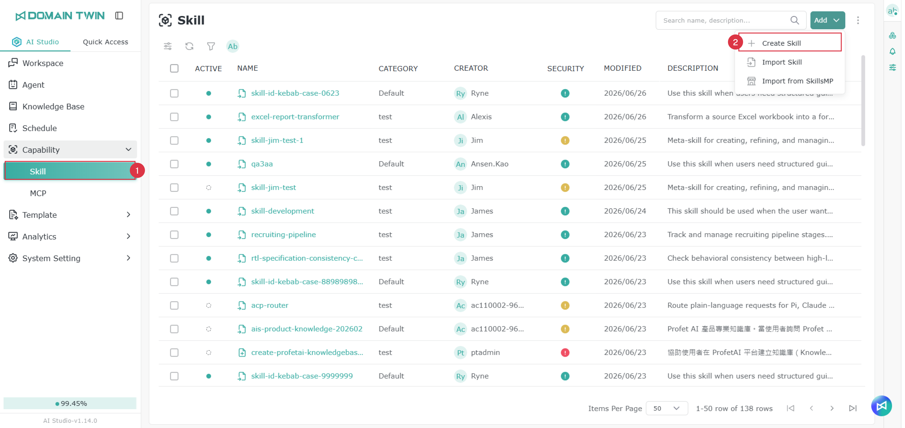

# スキル

## はじめに

異なる Skill を追加することで、Agent は外部情報の取得、ツールの連携、特定フローの処理、本来は直接実行できなかった操作の完了など、より多くの特定タスクを実行できます。ニーズに応じて Agent に適切な Skill を構成することで、応答やタスク実行をより柔軟にし、実際の利用シーンにより近づけられます。

<figure><figcaption></figcaption></figure>

## 手動でスキルを追加する

<figure><figcaption></figcaption></figure>

<figure><figcaption></figcaption></figure>

1. スキルのタブに移動します
2. 「新規追加」をクリックし、「作成」を選択します
3. 分類のグループを選択します。右側の「+」をクリックしてグループを追加することもできます
4. 左側はリストのディレクトリです。初めてスキルを作成すると、既定で削除できないフォルダーと Skill.md が1組あります。別途フォルダーやファイルを追加することもできます。追加方法は[フォルダーまたはファイルの追加](ji-neng.md#xin-zeng-zi-liao-jia-huo-dang-an)を参照してください
5. 形式に従ってファイル内容を記入します
6. 「発行」をクリックして作成を完了できます

> 注意： 保存は、内容をオンラインで使用できるよう発行することと同じではありません

### ファイルのインポート

左側リスト上部のファイルインポートボタンをクリックし、インポートする種類を選択します。ファイルインポートとディレクトリインポートがあります。

<figure><figcaption></figcaption></figure>

### フォルダー / ファイルの追加

左側リスト上部をクリックすると、ファイルまたはフォルダーの追加を選択でき、選んだ種類に応じて名前を入力します。

> 注意： ファイルを追加する際は拡張子を別途付ける必要があります。例：readme.md。

<figure><figcaption></figcaption></figure>

### フォルダーまたはファイルの編集 / 削除

編集または削除したいデータにマウスを合わせると、右側に機能ボタンが表示され、ユーザーはニーズに応じてクリックして使用できます

<figure><figcaption></figcaption></figure>

## スキルのインポート

<figure><figcaption></figcaption></figure>

<figure><figcaption></figcaption></figure>

1. スキルのタブに移動します
2. 「新規追加」をクリックし、「スキルのインポート」を選択します
3. 指定形式のファイルをインポートします（**.zip、.md、.skill** のみサポート）
4. 分類のグループを選択します。右側の「+」をクリックしてグループを追加することもできます
5. インポートをクリックして作成を完了します

## SkillsMP からスキルをインポートする

### SkillsMP インポートオプションを有効にする

<figure><figcaption></figcaption></figure>

<figure><figcaption></figcaption></figure>

<figure><figcaption></figcaption></figure>

<figure><figcaption></figcaption></figure>

AIS で SkillsMP インポートオプションを表示するには、まず以下の設定を完了してください：

1. SkillsMP 公式プラットフォームで個人または企業アカウントを申請し、API Key を1組作成します
   * 申請 URL：[https://skillsmp.com/docs/api](https://skillsmp.com/docs/api)
2. AIS に戻り、次に進みます：   &#x20;システム設定 → シークレット管理
3. 「新規追加」をクリックします
4. 「タイプ」欄で次を選択します：   SkillsMP
5. SkillsMP で取得した API Key を指定の欄に貼り付けます
6. 追加を完了すると、システムが SkillsMP インポートオプションを表示します

> 注意： SkillsMP インポート機能は、先に API Key 設定を完了してから表示されます。Key Management で SkillsMP Provider と対応する API Key を追加していない場合、システムは SkillsMP インポートオプションを表示しません。

#### 使用制限

SkillsMP API は、API Key を使用するかどうかに応じて、異なるリクエスト制限を適用します：

1. API Key を使用しない場合
   * 1日あたり最大50回のリクエストを送信できます
   * 1分あたり最大10回のリクエストを送信できます
   * キーワード検索のみサポート
2. API Key を使用する場合
   * 1日あたり最大500回のリクエストを送信できます
   * 1分あたり最大30回のリクエストを送信できます
   * キーワード検索をサポート
3. ワイルドカード検索は非対応
   * SkillsMP API はワイルドカードを使った検索に対応していません。例：\*
4. Quota 使用量の追跡
   * 各 API 応答には関連する response headers が含まれ、現在の quota 使用状況の追跡に使えます

### AIS 内で SkillsMP を使ってスキルをインポートする

<figure><figcaption></figcaption></figure>

<figure><figcaption></figcaption></figure>

1. スキルタブに移動します
2. 追加をクリックし、「SkillsMP からインポート」を選択します
3. グループを選択します
4. スキルを選択し、「+」をクリックしてインポートします

## セキュリティレベルの確認

各スキルはインポート後、システムが自動的にスキャンを行い、異なるセキュリティレベルに分類します。ユーザーはアイコンをクリックして詳細内容を確認できます。

<figure><figcaption></figcaption></figure>

<figure><figcaption></figcaption></figure>

### セキュリティレベルの判定

現在のセキュリティレベルの判定は、**OWASP Top 10 for LLM** の関連規範に基づいてチェック・評価しています。

参考資料：[https://genai.owasp.org/llm-top-10/](https://genai.owasp.org/llm-top-10/)

### スキルスキャンルール

スキルスキャンルールは、スキルスキャン時に使用するモデルとチェックルールを設定するために使います。この機能は、スキルの作成またはインポート時に、スキル内容がプラットフォームの規範に適合しているかをシステムがチェックするのを助け、安全でない設定、異常な動作、期待に合わない内容が使用されるリスクを低減します。

この機能は既定で有効です。特別なニーズがなければ、システムの既定設定を保持することをお勧めします。

> 設定の必要がある場合、**AI Studio 管理者**は以下のパスで設定ページに入れます：
>
> システム設定 → 構成 → スキルスキャン設定

## バージョン履歴

AI Studio はスキルのバージョン履歴を保持し、ユーザーが過去のスキル内容を確認したり、必要時にスキルを指定のバージョンに復元したりしやすくします。ユーザーはスキルリストでスキル名をクリックして詳細ページに入り、クリックするとそのスキルの内ページが開きます。

### バージョン履歴の確認

<figure><figcaption></figcaption></figure>

右上の履歴をクリックするとバージョン履歴ウィンドウが開きます。ユーザーはこの Skill の過去バージョンを確認できます。右側に各バージョンのバージョン番号、作成日時、作成者情報が表示され、いずれかのバージョンをクリックすると、中央エリアにそのバージョンの Skill 内容のプレビューが表示されます。

### バージョンの復元

<figure><figcaption></figcaption></figure>

スキルを過去のバージョンに復元する必要がある場合は、ウィンドウで復元したいバージョンを選択し、内容を確認してから**復元**をクリックします。復元すると、システムは現在のスキル内容を選択したバージョンの内容に更新します。現在の編集結果を上書きしないよう、復元前にバージョン内容が正しいか確認することをお勧めします。

> 注意： バージョンの復元は現在のスキル内容に影響します。実行前に、選択したバージョンと内容がニーズに合っているか確認してください。複数人で同じスキルを共同管理している場合は、復元前に関係する維持担当者と確認することをお勧めします。

## スキルの使用

使用する場所は2か所あります：

* **Agent → 左側のスキル設定**

<figure><figcaption></figcaption></figure>

<figure><figcaption></figcaption></figure>

* **Workflow → LLM Node → スキル設定**

<figure><figcaption></figcaption></figure>

<figure><figcaption></figcaption></figure>

## 権限

リスト権限については [モジュール権限ロールの紹介 - スキルリスト権限](../ru-men-zhi-nan/quan-xian-gong-neng-jie-shao.md#ji-neng-qing-dan) を参照してください。

権限設定については [権限操作機能の紹介 - Root 権限](../ru-men-zhi-nan/quan-xian-cao-zuo-gong-neng-jie-shao.md#root-quan-xian) を参照してください。

### スキル権限

ロール権限については [モジュール権限ロールの紹介 - スキル権限](../ru-men-zhi-nan/quan-xian-gong-neng-jie-shao.md#ji-neng) を参照してください。

権限設定については [権限操作機能の紹介 - Object ロール権限](../ru-men-zhi-nan/quan-xian-cao-zuo-gong-neng-jie-shao.md#jue-se-quan-xian) を参照してください。
